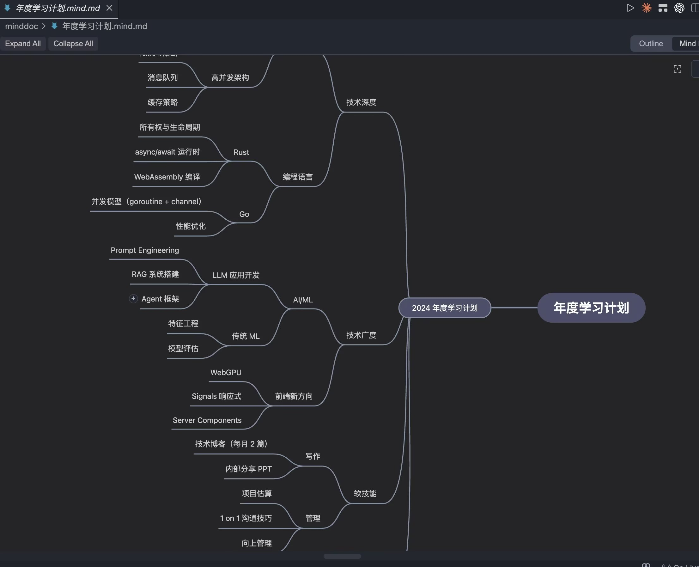
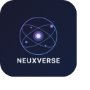

# MindCtx

Markdown 优先的结构化大纲编辑器，支持思维导图视图 —— 同时适配 Obsidian 和 VS Code。

写标准 Markdown，看交互式大纲，切换思维导图——所有数据始终存储在同一个 `.md` 文件中。原生 LLM 协作：一键将脑图转为结构化提示词，AI 输出回写即节点。



## 为什么选择 MindCtx

市面上不乏大纲工具和思维导图软件，但 MindCtx 的设计出发点是解决几个被忽略的痛点：

**Markdown 即数据源，而非导出格式。** 大多数思维导图工具把 Markdown 当作导入/导出的二等公民——导出的 md 丢失结构、导入后无法双向同步。MindCtx 让 `.md` 文件成为唯一的真实数据源，编辑结果直接写回原文件，Git 可追踪、任意编辑器可打开。

**为 LLM 协作而生。** `.mind.md` 是标准 Markdown，大模型天然就能读懂和生成。通过"复制为 AI 上下文"功能，一键将当前脑图结构转化为结构化提示词，粘贴给 ChatGPT/Claude 即可获得精准的文档整理、思路扩展或内容润色——AI 的输出拖回来直接就是可编辑的节点。

**本地优先，数据自有。** 不需要注册账号、不需要云同步、不需要付费订阅。所有数据以纯文本文件存在本地，你可以用任何同步工具（Git、iCloud、Syncthing）自行管理。

**拖拽整理 + 键盘高效。** 大纲视图和思维导图视图共享同一套操作模型，拖拽是直观的，键盘是高效的——两者任一视图中的结构调整都会实时反映到另一个视图。

## 特性

**双视图**
- 大纲视图：拖拽排序、键盘快捷键、行内编辑、搜索筛选
- 思维导图视图：基于 Mind Elixir，支持拖拽重组、缩放、聚焦
- 一键切换，数据实时同步

**往返保真**
- Markdown 文件就是唯一的数据源
- 未修改的内容保持原样格式（`serialize(parse(text)) === text`）
- 编辑只影响变化的节点

**编辑能力**
- 拖拽排序（大纲和脑图均支持）
- 行内标题编辑（双击或 F2）
- 快捷键：Tab/Shift+Tab（缩进/提升）、Enter（新建兄弟节点）、Delete（删除）、Ctrl+Z/Y（撤销/重做）
- 任务复选框切换
- 节点详情面板：编辑备注，查看附属内容

**导入导出**
- 导入：OPML（幕布/WorkFlowy）、FreeMind（.mm）
- 导出：OPML、JSON、PNG（脑图视图下）
- 复制为 AI 上下文（结构化提示词，适合粘贴给 ChatGPT/Claude）

## 平台支持

| 平台 | 包名 | 说明 |
|------|------|------|
| [Obsidian](packages/obsidian/) | `@mindctx/obsidian` | 社区插件，支持嵌入块、移动端 |
| [VS Code](packages/vscode/) | `vscode-mindctx` | Custom Editor 扩展，原生撤销/重做集成 |

两个平台共享同一个核心引擎 [`@mindctx/core`](packages/core/)。

## 文件格式

MindCtx 使用标准 Markdown。标题成为树的分支，列表成为叶节点：

```markdown
---
mindctx: true
heading-depth: 3
---

# 项目规划

## 第一阶段

- 需求调研
  - 用户访谈
  - 竞品分析

## 第二阶段

- 开发实现
- 测试验证
```

`heading-depth`（默认 3）控制标题转列表的分界线。详见 [格式规范](docs/format-spec.md)。

## 快捷键

| 按键 | 功能 |
|------|------|
| ↑/↓ | 在节点间导航 |
| Enter | 创建兄弟节点 |
| Tab | 缩进节点 |
| Shift+Tab | 提升节点 |
| Ctrl+↑/↓ | 上移/下移节点 |
| F2 | 编辑节点标题 |
| Delete | 删除节点 |
| Ctrl+Z | 撤销 |
| Ctrl+Shift+Z | 重做 |
| Ctrl+F | 搜索 |

## 开发

```bash
pnpm install          # 安装依赖
pnpm build            # 构建所有包
pnpm test             # 运行核心引擎测试（125 个测试）
pnpm typecheck        # 全包类型检查
```

### 项目结构

```
packages/
  core/               # 共享核心引擎（解析器、序列化器、操作、撤销、导入导出）
  obsidian/           # Obsidian 插件
  vscode/             # VS Code 扩展
docs/
  format-spec.md      # .mind.md 格式规范
  快速上手.md          # 用户快速入门
  功能指南.md          # 完整功能文档
  进阶技巧.md          # 进阶使用技巧
examples/             # 示例 .mind.md 文件
```

### 技术栈

- **工程**：pnpm workspaces monorepo、TypeScript 5（严格模式）
- **核心**：unified/remark（Markdown 解析）、tsup（库打包）
- **UI**：Preact + @preact/signals、Mind Elixir v4（思维导图）
- **构建**：esbuild（Obsidian 插件 + VSCode 扩展双目标）
- **测试**：Vitest

### 包开发

```bash
# 开发 Obsidian 插件（监听模式）
pnpm --filter @mindctx/obsidian dev

# 开发 VS Code 扩展（监听模式）
pnpm --filter vscode-mindctx dev

# 只构建核心包
pnpm --filter @mindctx/core build

# 运行测试
pnpm --filter @mindctx/core test
```

## 文档

- [快速上手](docs/快速上手.md) — 5 分钟入门
- [功能指南](docs/功能指南.md) — 完整功能文档
- [进阶技巧](docs/进阶技巧.md) — 高效使用方法
- [格式规范](docs/format-spec.md) — .mind.md 文件格式详解

## 许可证

MIT

---

<p align="center">
  <a href="https://github.com/CoderJackZhu">
    
  </a>
  <br>
  Built by <strong>Neuxverse</strong>
</p>
